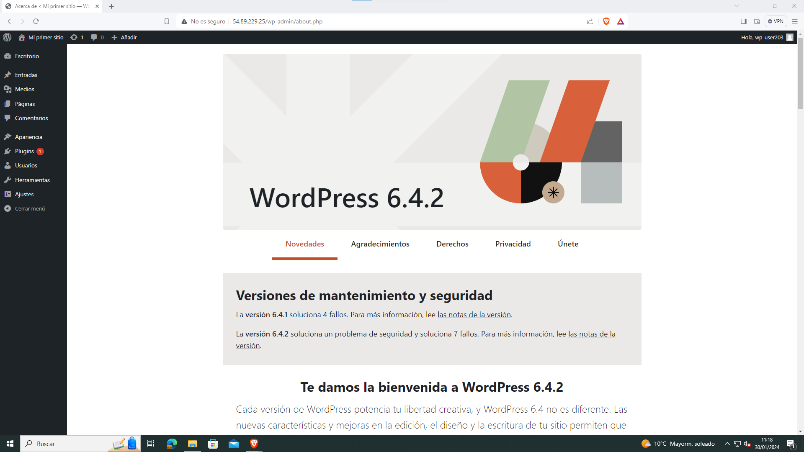

# Instalacion del CMS Wordpress sobre LAMP
1. Instalar paquetes php necesarios.
   ```
   apt install php-curl php-gd php-mbstring php-xml php-xmlrpc php-soap php-intl php-zip
   ```
    

2. Creacion y configuracion de la base de datos que utilizara wordpress.
   ``` 
   mariadb -u root -p
   ```
   ```
   create database wordpress;
   use wordpress;
   create user 'wp_user203'@’localhost’ identified by 'alumno203';
   grant all privileges on wordpress.* to 'wp_user203'@’localhost’ with grant option;
   flush privileges;
   quit;
   ```
   
   
   

3. Configuracion de apache
   - Modificar el archivo 000-default.conf 
   ```
   cd /etc/apache2/sites-aviable
   nano 000-default.conf
   ``` 
   
   Tiene que quedar como el de la siguiente imagen.
   
   - Activar el mod_rewrite para usar la funcion de enlace permante.
   ```
   a2enmod rewrite
   ``` 
   
4. Descargar e instalar Wordpress
   - Instalar el paquete wget.
        ```
        apt install wget -y
        ``` 
        
   - Descargar wordpress utilizando wget.
        ```
        wget https://es.wordpress.org/latest-es_ES.zip -P /tmp

        ```
        
   - Instalar la herramienta unzip
        ```
        apt install unzip -y
        ```
        
   - Descomprimir el archivo zip de wordpress
        ```
        cd /tmp
        unzip latest-es_ES.zip
        ```
        
   - Mover el contenido descargado y descomprimido a /var/www/html, cambiar el usuario pripetario y reiniciar apache2.
        ```
        mv -f /tmp/wordpress/* /var/www/html
        sudo chown -R www-data:www-data /var/www/html
        sudo systemctl restart apache2
        ```
        
   - Terminar de configurar wordpress en el navegador y una vez terminado   aparecera la pagina inicial de wordpress
        